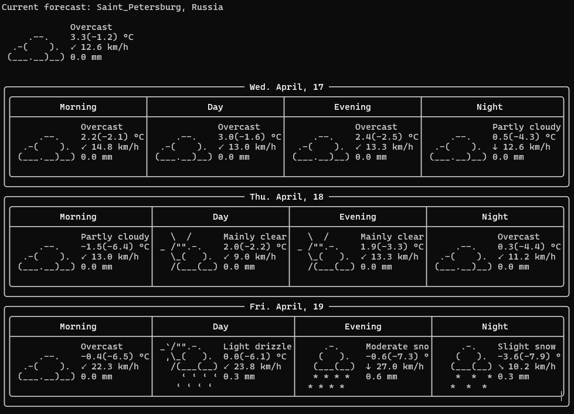

# Weather-Forecaster

## Продукт

Консольное приложение, отображающие прогноз погоды для выбранного списка городов, используя сторонние библиотеки:

- [Open-Meteo](https://open-meteo.com/en/docs#latitude=59.94&longitude=30.31&hourly=temperature_2m&forecast_days=16) для
  прогноза
- [Api-Ninjas](https://api-ninjas.com/api/city) для определения координат по названию города
- [C++ Requests](https://github.com/libcpr/cpr) для HTTP-запросов

## Функционал

- Отображение прогноза погоды на несколько дней вперед (значение по умолчанию задается конфигом)
- Обновление с некоторой частотой (задается конфигом)
- Переключение между городами с помощью клавиш "n", "p"
- Завершение работу программы по Esc
- Увеличивать\уменьшать количество дней прогноза по нажатие клавиш "+", "-"

Список городов, частота обновления, количество дней прогноза определены в конфиге(config.json).

## Интерфейс

